<!-- README.md is generated from README.Rmd. Please edit that file -->

# AlleleShift

`AlleleShift` is an R package to predict and visualize population-level
changes in allele frequencies.

The following manuscript provides details on the methods used by the
package: Kindt R. 2021 (in prep.) AlleleShift: An R package to predict
and visualize population-level changes in allele frequencies in response
to climate change.

# Installation

To install from CRAN, use:

``` r
install.packages('AlleleShift')
```


The package can be installed from github via:

``` r
# install.packages('devtools')
devtools::install_github('RoelandKindt/AlleleShift')
```

# Packages needed

``` r
library(BiodiversityR) # also loads vegan
library(poppr) # also loads adegenet
library(ggplot2)
library(ggsci)
library(ggforce)
library(dplyr)
library(ggrepel)
library(patchwork)
library(GGally)
library(mgcv)
library(ggmap)
library(gggibbous)
library(gganimate)

library(AlleleShift)
```

# Predicting shifts in allele frequencies

The following script is also available from the documentation of the
‘count.model’ function.

Input data ‘Poptri.baseline.env’ and ‘Poptri.future.env’ document
bioclimatic conditions for populations in baseline and future climates.
‘Poptri.genind’ is information on allele counts of individuals in the
‘adegenet::genind’ format (note that packages ‘adegenet’ and ‘poppr’
offer various methods of importing data from other applications).

``` r
# 1. Reduce the number of explanatory variables

data(Poptri.baseline.env)
data(Poptri.future.env)

VIF.select <- VIF.subset(Poptri.baseline.env, 
                         keep=c("MAT", "CMI"), 
                         cor.plot=TRUE)  
#> Step 1: Keeping these vars: 
#>  [1] "MAT"    "CMI"    "TD"     "MSP"    "AHM"    "SHM"    "DD.0"   "bFFP"  
#>  [9] "PAS"    "Eref"   "CMD"    "cmiJJA" "PPT_sm" "Tmax07"
#> 
#> Variance inflation (package: car)
#>        MAT         TD        MSP        AHM        SHM       DD.0       bFFP 
#> 1956.71402   55.35151  325.04715  258.27807  199.03579  383.71475  208.48116 
#>        PAS       Eref        CMD        CMI     cmiJJA     PPT_sm     Tmax07 
#>  418.39278  509.80399  702.97284  729.58048 2108.47844 1221.60927  404.91923 
#> 
#> VIF directly calculated from linear model with focal numeric variable as response
#>     cmiJJA        MAT     PPT_sm        CMI        CMD       Eref        PAS 
#> 2108.47844 1956.71402 1221.60927  729.58048  702.97284  509.80399  418.39278 
#>     Tmax07       DD.0        MSP        AHM       bFFP        SHM         TD 
#>  404.91923  383.71475  325.04715  258.27807  208.48116  199.03579   55.35151 
#> 
#> Variance inflation (package: car)
#>        MAT         TD        MSP        AHM        SHM       DD.0       bFFP 
#> 1152.51188   51.00442  280.39905  196.06676  189.87780  289.82940  177.01912 
#>        PAS       Eref        CMD        CMI     PPT_sm     Tmax07 
#>  373.46930  302.59709  652.89020  548.59673  527.99218  186.61090 
#> 
#> VIF directly calculated from linear model with focal numeric variable as response
#>        MAT        CMD        CMI     PPT_sm        PAS       Eref       DD.0 
#> 1152.51188  652.89020  548.59673  527.99218  373.46930  302.59709  289.82940 
#>        MSP        AHM        SHM     Tmax07       bFFP         TD 
#>  280.39905  196.06676  189.87780  186.61090  177.01912   51.00442 
#> 
#> Variance inflation (package: car)
#>       MAT        TD       MSP       AHM       SHM      DD.0      bFFP       PAS 
#> 775.21530  48.40917 275.40371 179.50626  90.11375 260.05137 146.29625 368.40367 
#>      Eref       CMI    PPT_sm    Tmax07 
#> 102.83305 545.11114 394.89879 180.19703 
#> 
#> VIF directly calculated from linear model with focal numeric variable as response
#>       MAT       CMI    PPT_sm       PAS       MSP      DD.0    Tmax07       AHM 
#> 775.21530 545.11114 394.89879 368.40367 275.40371 260.05137 180.19703 179.50626 
#>      bFFP      Eref       SHM        TD 
#> 146.29625 102.83305  90.11375  48.40917 
#> 
#> Variance inflation (package: car)
#>       MAT        TD       MSP       AHM       SHM      DD.0      bFFP       PAS 
#> 528.61146  32.01349 145.93063  78.09567  53.38943 222.17330 145.00874 188.09374 
#>      Eref       CMI    Tmax07 
#> 102.40225 306.50400 111.10074 
#> 
#> VIF directly calculated from linear model with focal numeric variable as response
#>       MAT       CMI      DD.0       PAS       MSP      bFFP    Tmax07      Eref 
#> 528.61146 306.50400 222.17330 188.09374 145.93063 145.00874 111.10074 102.40225 
#>       AHM       SHM        TD 
#>  78.09567  53.38943  32.01349 
#> 
#> Variance inflation (package: car)
#>       MAT        TD       MSP       AHM       SHM      bFFP       PAS      Eref 
#> 291.46937  30.38197  64.59840  46.78232  37.94467  45.37584  45.57930  99.66232 
#>       CMI    Tmax07 
#>  93.58775 109.62229 
#> 
#> VIF directly calculated from linear model with focal numeric variable as response
#>       MAT    Tmax07      Eref       CMI       MSP       AHM       PAS      bFFP 
#> 291.46937 109.62229  99.66232  93.58775  64.59840  46.78232  45.57930  45.37584 
#>       SHM        TD 
#>  37.94467  30.38197 
#> 
#> Variance inflation (package: car)
#>        MAT         TD        MSP        AHM        SHM       bFFP        PAS 
#> 237.300281   4.513064  62.232526  46.486704  37.871152  44.616210  44.930713 
#>       Eref        CMI 
#>  33.411744  85.667431 
#> 
#> VIF directly calculated from linear model with focal numeric variable as response
#>        MAT        CMI        MSP        AHM        PAS       bFFP        SHM 
#> 237.300281  85.667431  62.232526  46.486704  44.930713  44.616210  37.871152 
#>       Eref         TD 
#>  33.411744   4.513064 
#> 
#> Variance inflation (package: car)
#>        MAT         TD        AHM        SHM       bFFP        PAS       Eref 
#> 218.240423   4.170754  25.872364   5.680412  43.733182  39.989330  32.625175 
#>        CMI 
#>  27.162467 
#> 
#> VIF directly calculated from linear model with focal numeric variable as response
#>        MAT       bFFP        PAS       Eref        CMI        AHM        SHM 
#> 218.240423  43.733182  39.989330  32.625175  27.162467  25.872364   5.680412 
#>         TD 
#>   4.170754 
#> 
#> Variance inflation (package: car)
#>       MAT        TD       AHM       SHM       PAS      Eref       CMI 
#> 56.168045  4.154401 24.524555  5.474406 31.877700 13.105090 22.368212 
#> 
#> VIF directly calculated from linear model with focal numeric variable as response
#>       MAT       PAS       AHM       CMI      Eref       SHM        TD 
#> 56.168045 31.877700 24.524555 22.368212 13.105090  5.474406  4.154401 
#> 
#> Variance inflation (package: car)
#>       MAT        TD       AHM       SHM      Eref       CMI 
#>  8.713339  4.003336 19.299959  5.465614  9.025702 14.431931 
#> 
#> VIF directly calculated from linear model with focal numeric variable as response
#>       AHM       CMI      Eref       MAT       SHM        TD 
#> 19.299959 14.431931  9.025702  8.713339  5.465614  4.003336 
#> 
#> Summary of VIF selection process:
#>                MAT        TD       MSP       AHM        SHM     DD.0      bFFP
#> step_1 1956.714025 55.351511 325.04715 258.27807 199.035789 383.7148 208.48116
#> step_2 1152.511883 51.004421 280.39905 196.06676 189.877801 289.8294 177.01912
#> step_3  775.215296 48.409171 275.40371 179.50626  90.113750 260.0514 146.29625
#> step_4  528.611459 32.013493 145.93063  78.09567  53.389431 222.1733 145.00874
#> step_5  291.469373 30.381965  64.59840  46.78232  37.944668       NA  45.37584
#> step_6  237.300281  4.513064  62.23253  46.48670  37.871152       NA  44.61621
#> step_7  218.240423  4.170754        NA  25.87236   5.680412       NA  43.73318
#> step_8   56.168045  4.154401        NA  24.52456   5.474406       NA        NA
#> step_9    8.713339  4.003336        NA  19.29996   5.465614       NA        NA
#>              PAS       Eref      CMD       CMI   cmiJJA    PPT_sm   Tmax07
#> step_1 418.39278 509.803994 702.9728 729.58048 2108.478 1221.6093 404.9192
#> step_2 373.46930 302.597094 652.8902 548.59673       NA  527.9922 186.6109
#> step_3 368.40367 102.833047       NA 545.11114       NA  394.8988 180.1970
#> step_4 188.09374 102.402249       NA 306.50400       NA        NA 111.1007
#> step_5  45.57930  99.662321       NA  93.58775       NA        NA 109.6223
#> step_6  44.93071  33.411744       NA  85.66743       NA        NA       NA
#> step_7  39.98933  32.625175       NA  27.16247       NA        NA       NA
#> step_8  31.87770  13.105090       NA  22.36821       NA        NA       NA
#> step_9        NA   9.025702       NA  14.43193       NA        NA       NA
#> 
#> Final selection of variables:
#> [1] "AHM"  "CMI"  "Eref" "MAT"  "SHM"  "TD"

VIF.select$VIF$vars.included
#> [1] "AHM"  "CMI"  "Eref" "MAT"  "SHM"  "TD"

baseline.env <- Poptri.baseline.env[, VIF.select$VIF$vars.included] 
summary(baseline.env)
#>       AHM             CMI             Eref            MAT        
#>  Min.   : 5.50   Min.   : 29.0   Min.   :455.0   Min.   : 1.690  
#>  1st Qu.: 8.45   1st Qu.: 55.5   1st Qu.:602.0   1st Qu.: 5.620  
#>  Median :10.80   Median : 97.0   Median :675.0   Median : 8.980  
#>  Mean   :12.06   Mean   :109.5   Mean   :680.9   Mean   : 7.903  
#>  3rd Qu.:16.80   3rd Qu.:150.5   3rd Qu.:773.5   3rd Qu.:10.045  
#>  Max.   :19.50   Max.   :232.0   Max.   :920.0   Max.   :11.290  
#>       SHM               TD       
#>  Min.   : 23.50   Min.   :13.90  
#>  1st Qu.: 38.45   1st Qu.:14.25  
#>  Median : 50.20   Median :15.30  
#>  Mean   : 56.53   Mean   :16.11  
#>  3rd Qu.: 74.40   3rd Qu.:17.60  
#>  Max.   :102.90   Max.   :20.10

future.env <- Poptri.future.env[, VIF.select$VIF$vars.included] 


# 2. Create the genpop object

data(Poptri.genind)
Poptri.genpop <- adegenet::genind2genpop(Poptri.genind)
#> 
#>  Converting data from a genind to a genpop object... 
#> 
#> ...done.

# Get to know the populations and the alleles
poppr::poppr(Poptri.genind)
#>                   Pop   N MLG eMLG    SE     H    G lambda   E.5  Hexp       Ia
#> 1          Chilliwack  38  14 5.67 1.244 1.972 3.97  0.748 0.480 0.168  0.29948
#> 2            Columbia 180  31 6.69 1.276 2.634 8.17  0.878 0.555 0.219  0.03214
#> 3                Dean   7   4 4.00 0.000 1.352 3.77  0.735 0.967 0.145 -0.16667
#> 4            Harrison  22  10 5.87 1.093 1.855 4.10  0.756 0.575 0.191  0.06387
#> 5            Homathko   9   7 7.00 0.000 1.831 5.40  0.815 0.840 0.182 -0.17703
#> 6             Kitimat   8   4 4.00 0.000 1.321 3.56  0.719 0.930 0.127 -0.13245
#> 7          Klinaklini   8   5 5.00 0.000 1.494 4.00  0.750 0.868 0.155 -0.41248
#> 8           Nisqually  14   7 5.51 0.830 1.567 3.38  0.704 0.627 0.157  0.00845
#> 9            Nooksack  26  11 6.44 1.072 2.124 6.76  0.852 0.782 0.211  0.05709
#> 10 Olympic_Penninsula   5   3 3.00 0.000 0.950 2.27  0.560 0.802 0.191 -0.25000
#> 11           Puyallup 186  29 6.03 1.303 2.396 5.81  0.828 0.482 0.178 -0.02222
#> 12             Salmon  11   7 6.64 0.481 1.846 5.76  0.826 0.892 0.193 -0.19978
#> 13             Skagit 163  20 5.41 1.268 2.102 4.72  0.788 0.518 0.168 -0.01194
#> 14            Skwawka  14   6 5.29 0.656 1.631 4.45  0.776 0.841 0.160 -0.04804
#> 15          Skykomish 156  31 6.97 1.249 2.730 9.26  0.892 0.576 0.233  0.07931
#> 16           Squamish  14  10 7.86 0.802 2.206 8.17  0.878 0.887 0.205 -0.28884
#> 17              Tahoe  12   9 7.82 0.649 2.095 7.20  0.861 0.870 0.293 -0.11481
#> 18  Vancouver I. East  12   4 3.50 0.584 0.837 1.71  0.417 0.546 0.107  0.48361
#> 19         Willamette  17  10 6.65 1.016 2.007 5.45  0.817 0.691 0.246  0.11902
#> 20              Total 902  59 6.38 1.323 2.663 6.93  0.856 0.445 0.200  0.03621
#>       rbarD          File
#> 1   0.08166 Poptri.genind
#> 2   0.00883 Poptri.genind
#> 3  -0.16667 Poptri.genind
#> 4   0.02067 Poptri.genind
#> 5  -0.04770 Poptri.genind
#> 6  -0.14222 Poptri.genind
#> 7  -0.21444 Poptri.genind
#> 8   0.00445 Poptri.genind
#> 9   0.01646 Poptri.genind
#> 10 -0.25000 Poptri.genind
#> 11 -0.00606 Poptri.genind
#> 12 -0.07663 Poptri.genind
#> 13 -0.00373 Poptri.genind
#> 14 -0.01849 Poptri.genind
#> 15  0.02249 Poptri.genind
#> 16 -0.08273 Poptri.genind
#> 17 -0.03060 Poptri.genind
#> 18  0.27081 Poptri.genind
#> 19  0.04139 Poptri.genind
#> 20  0.00998 Poptri.genind
adegenet::makefreq(Poptri.genpop)
#> 
#>  Finding allelic frequencies from a genpop object... 
#> 
#> ...done.
#>                    X01_10838495.1 X01_10838495.2 X01_16628872.1 X01_16628872.2
#> Chilliwack             0.10526316      0.8947368     0.19736842      0.8026316
#> Columbia               0.23055556      0.7694444     0.20000000      0.8000000
#> Dean                   0.21428571      0.7857143     0.00000000      1.0000000
#> Harrison               0.15909091      0.8409091     0.25000000      0.7500000
#> Homathko               0.05555556      0.9444444     0.22222222      0.7777778
#> Kitimat                0.25000000      0.7500000     0.12500000      0.8750000
#> Klinaklini             0.06250000      0.9375000     0.43750000      0.5625000
#> Nisqually              0.10714286      0.8928571     0.25000000      0.7500000
#> Nooksack               0.17307692      0.8269231     0.26923077      0.7307692
#> Olympic_Penninsula     0.50000000      0.5000000     0.10000000      0.9000000
#> Puyallup               0.17204301      0.8279570     0.16935484      0.8306452
#> Salmon                 0.04545455      0.9545455     0.27272727      0.7272727
#> Skagit                 0.23619632      0.7638037     0.18098160      0.8190184
#> Skwawka                0.03571429      0.9642857     0.32142857      0.6785714
#> Skykomish              0.20192308      0.7980769     0.31410256      0.6858974
#> Squamish               0.28571429      0.7142857     0.25000000      0.7500000
#> Tahoe                  0.62500000      0.3750000     0.08333333      0.9166667
#> Vancouver I. East      0.16666667      0.8333333     0.00000000      1.0000000
#> Willamette             0.35294118      0.6470588     0.20588235      0.7941176
#>                    X01_23799134.1 X01_23799134.2 X01_38900650.1 X01_38900650.2
#> Chilliwack             0.06578947      0.9342105     0.05263158      0.9473684
#> Columbia               0.10833333      0.8916667     0.06944444      0.9305556
#> Dean                   0.00000000      1.0000000     0.21428571      0.7857143
#> Harrison               0.11363636      0.8863636     0.02272727      0.9772727
#> Homathko               0.05555556      0.9444444     0.05555556      0.9444444
#> Kitimat                0.00000000      1.0000000     0.00000000      1.0000000
#> Klinaklini             0.00000000      1.0000000     0.00000000      1.0000000
#> Nisqually              0.00000000      1.0000000     0.00000000      1.0000000
#> Nooksack               0.01923077      0.9807692     0.07692308      0.9230769
#> Olympic_Penninsula     0.00000000      1.0000000     0.00000000      1.0000000
#> Puyallup               0.04569892      0.9543011     0.05107527      0.9489247
#> Salmon                 0.00000000      1.0000000     0.04545455      0.9545455
#> Skagit                 0.03987730      0.9601227     0.01840491      0.9815951
#> Skwawka                0.07142857      0.9285714     0.00000000      1.0000000
#> Skykomish              0.11217949      0.8878205     0.03525641      0.9647436
#> Squamish               0.03571429      0.9642857     0.03571429      0.9642857
#> Tahoe                  0.04166667      0.9583333     0.41666667      0.5833333
#> Vancouver I. East      0.00000000      1.0000000     0.08333333      0.9166667
#> Willamette             0.00000000      1.0000000     0.14705882      0.8529412
#>                    X01_41284594.1 X01_41284594.2
#> Chilliwack             0.05263158      0.9473684
#> Columbia               0.05000000      0.9500000
#> Dean                   0.00000000      1.0000000
#> Harrison               0.02272727      0.9772727
#> Homathko               0.11111111      0.8888889
#> Kitimat                0.00000000      1.0000000
#> Klinaklini             0.06250000      0.9375000
#> Nisqually              0.10714286      0.8928571
#> Nooksack               0.09615385      0.9038462
#> Olympic_Penninsula     0.10000000      0.9000000
#> Puyallup               0.07526882      0.9247312
#> Salmon                 0.22727273      0.7727273
#> Skagit                 0.03374233      0.9662577
#> Skwawka                0.07142857      0.9285714
#> Skykomish              0.07692308      0.9230769
#> Squamish               0.03571429      0.9642857
#> Tahoe                  0.12500000      0.8750000
#> Vancouver I. East      0.04166667      0.9583333
#> Willamette             0.08823529      0.9117647

# 3. Calibrate the models

# Note that the ordistep procedure is not needed
Poptri.count.model <- count.model(Poptri.genpop, 
                                  env.data=baseline.env, 
                  ordistep=TRUE)
#> 
#>  Finding allelic frequencies from a genpop object... 
#> 
#> ...done.
#> 
#> 
#> Call:
#> rda(formula = gen.comm.b ~ AHM + CMI + Eref + MAT + SHM + TD,      data = env.data) 
#> 
#> Partitioning of variance:
#>               Inertia Proportion
#> Total           13675     1.0000
#> Constrained      6841     0.5002
#> Unconstrained    6834     0.4998
#> 
#> Eigenvalues, and their contribution to the variance 
#> 
#> Importance of components:
#>                            RDA1      RDA2      RDA3      RDA4      RDA5
#> Eigenvalue            5203.4791 893.09032 489.16133 249.89783 5.3852777
#> Proportion Explained     0.3805   0.06531   0.03577   0.01827 0.0003938
#> Cumulative Proportion    0.3805   0.44580   0.48157   0.49985 0.5002410
#>                             PC1       PC2       PC3       PC4      PC5
#> Eigenvalue            4597.4331 1443.5788 458.75766 243.85111 90.80236
#> Proportion Explained     0.3362    0.1056   0.03355   0.01783  0.00664
#> Cumulative Proportion    0.8364    0.9420   0.97553   0.99336  1.00000
#> 
#> Accumulated constrained eigenvalues
#> Importance of components:
#>                            RDA1     RDA2     RDA3      RDA4      RDA5
#> Eigenvalue            5203.4791 893.0903 489.1613 249.89783 5.3852777
#> Proportion Explained     0.7606   0.1305   0.0715   0.03653 0.0007872
#> Cumulative Proportion    0.7606   0.8912   0.9627   0.99921 1.0000000
#> 
#> Scaling 2 for species and site scores
#> * Species are scaled proportional to eigenvalues
#> * Sites are unscaled: weighted dispersion equal on all dimensions
#> * General scaling constant of scores:  22.27427 
#> 
#> 
#> Species scores
#> 
#>                   RDA1    RDA2     RDA3      RDA4     RDA5      PC1
#> X01_10838495.1  7.7466 -0.7259 -1.69114  0.187490 -0.01266  6.28376
#> X01_10838495.2 -7.7466  0.7259  1.69114 -0.187490  0.01266 -6.28376
#> X01_16628872.1 -2.2584  2.5545 -1.43674  0.084325 -0.17373 -5.83911
#> X01_16628872.2  2.2584 -2.5545  1.43674 -0.084325  0.17373  5.83911
#> X01_23799134.1 -0.4671  1.9706 -0.83990 -0.001968  0.25745  0.03723
#> X01_23799134.2  0.4671 -1.9706  0.83990  0.001968 -0.25745 -0.03723
#> X01_38900650.1  5.2463  2.2731  1.80100  0.256469 -0.03033  2.62821
#> X01_38900650.2 -5.2463 -2.2731 -1.80100 -0.256469  0.03033 -2.62821
#> X01_41284594.1  1.2400  0.3130  0.01204 -2.103589 -0.01203 -1.70511
#> X01_41284594.2 -1.2400 -0.3130 -0.01204  2.103589  0.01203  1.70511
#> 
#> 
#> Site scores (weighted sums of species scores)
#> 
#>                       RDA1     RDA2     RDA3     RDA4     RDA5      PC1
#> Chilliwack         -3.6364   1.6841   5.3973   1.4271   39.264   2.5785
#> Columbia            0.4218   2.5336  -3.8742   4.1743   71.373   0.4335
#> Dean                4.6551  -6.6279  24.0513  14.2372   83.823   8.0787
#> Harrison           -3.3140   4.2633  -5.5469   7.1447   53.583  -2.0779
#> Homathko           -5.0101   4.0804   8.0351  -9.1976   12.167  -4.4760
#> Kitimat             0.2023 -11.0757  -2.1893  11.1417   24.158   6.4103
#> Klinaklini         -7.9981  10.8293  -7.6871  -0.3698 -176.410 -12.6881
#> Nisqually          -4.7481  -0.5922   0.4640  -8.6869  -56.562  -7.2177
#> Nooksack           -1.4050   4.2429  -0.2436  -4.0265  -61.991   1.2854
#> Olympic_Penninsula  8.5460 -15.9908 -18.3575  -2.4474   24.067   4.1194
#> Puyallup           -1.2328  -1.8999   2.9514  -1.6765   34.025   1.7945
#> Salmon             -5.3069   5.0051   6.9613 -29.2596  -79.379  -6.6457
#> Skagit             -0.2454  -4.5544  -4.5800   5.8729   23.210   5.9223
#> Skwawka            -7.8707   7.7636  -1.3073  -3.1379  -28.712  -4.6465
#> Skykomish          -2.0503   8.2869 -11.4201  -0.8444    3.752   0.6351
#> Squamish            1.0273  -0.6021 -10.7934   7.1369  -31.007   1.5425
#> Tahoe              21.1711   4.7608   3.7894   3.8075   20.644   4.3325
#> Vancouver I. East   0.6973 -12.3697  17.5610   3.5557   99.335   1.0511
#> Willamette          6.0970   0.2625  -3.2114   1.1486  -55.342  -0.4317
#> 
#> 
#> Site constraints (linear combinations of constraining variables)
#> 
#>                       RDA1      RDA2     RDA3    RDA4    RDA5      PC1
#> Chilliwack         -5.3411   2.94631 -5.73690 -1.2669  3.6318   2.5785
#> Columbia            1.0348   1.48239 -4.35834 -1.9144 -1.5967   0.4335
#> Dean               -0.7121   3.05536 13.59960  5.7383 -2.3972   8.0787
#> Harrison           -0.6115   4.57450 -6.67046 12.7199  1.7520  -2.0779
#> Homathko           -0.2101   4.51571  2.95659  0.1637  3.7693  -4.4760
#> Kitimat            -5.7357  -7.72450  0.08812  2.8441  6.3705   6.4103
#> Klinaklini          0.9827  -2.48137  3.56265  6.7122 -7.5810 -12.6881
#> Nisqually           1.1218  -6.23684 -1.27479  0.7219 -0.9320  -7.2177
#> Nooksack           -3.6818   3.17251 -4.89865 -2.9837 -3.8484   1.2854
#> Olympic_Penninsula  5.1563  -8.68730 -3.34262 -4.1673  0.8657   4.1194
#> Puyallup           -2.4480  -0.01102 -0.54619  0.1670 -4.9542   1.7945
#> Salmon             -1.1061  -0.60968  4.52845 -8.3433 -0.9208  -6.6457
#> Skagit             -5.9406  -1.76614  0.27739  1.5322 -6.8831   5.9223
#> Skwawka            -4.4370   1.80687  6.44400 -4.1364 14.0686  -4.6465
#> Skykomish          -1.9900  10.49790 -2.02179 -9.1465 -5.7696   0.6351
#> Squamish           -1.1546   0.32081  1.41105  4.4112  0.9792   1.5425
#> Tahoe              16.7611   4.67546  3.53694 -0.3315  1.2278   4.3325
#> Vancouver I. East   2.2338 -10.24318  1.07117 -4.5355 -3.0133   1.0511
#> Willamette          6.0779   0.71222 -8.62622  1.8151  5.2313  -0.4317
#> 
#> 
#> Biplot scores for constraining variables
#> 
#>          RDA1     RDA2    RDA3     RDA4    RDA5 PC1
#> AHM   0.13353 -0.29604 -0.5719 -0.16042 -0.4093   0
#> CMI  -0.31497  0.20319  0.5713  0.04335  0.5768   0
#> Eref  0.29012  0.03393 -0.7039 -0.35686 -0.1588   0
#> MAT  -0.07412 -0.21901 -0.7120 -0.54165 -0.1552   0
#> SHM   0.63769 -0.32011 -0.5075 -0.10019 -0.1988   0
#> TD   -0.18759  0.19007  0.3043  0.67274  0.4208   0
#> 
#> Permutation test for rda under reduced model
#> Permutation: free
#> Number of permutations: 99
#> 
#> Model: rda(formula = gen.comm.b ~ AHM + CMI + Eref + MAT + SHM + TD, data = env.data)
#>          Df Variance      F Pr(>F)  
#> Model     6   6841.0 2.0019   0.08 .
#> Residual 12   6834.4                
#> ---
#> Signif. codes:  0 '***' 0.001 '**' 0.01 '*' 0.05 '.' 0.1 ' ' 1
#> Permutation test for rda under reduced model
#> Terms added sequentially (first to last)
#> Permutation: free
#> Number of permutations: 99
#> 
#> Model: rda(formula = gen.comm.b ~ AHM + CMI + Eref + MAT + SHM + TD, data = env.data)
#>          Df Variance      F Pr(>F)  
#> AHM       1    338.4 0.5942   0.58  
#> CMI       1   1803.1 3.1659   0.07 .
#> Eref      1   1054.0 1.8507   0.14  
#> MAT       1    872.8 1.5325   0.20  
#> SHM       1   2259.1 3.9666   0.03 *
#> TD        1    513.5 0.9017   0.35  
#> Residual 12   6834.4                
#> ---
#> Signif. codes:  0 '***' 0.001 '**' 0.01 '*' 0.05 '.' 0.1 ' ' 1
#> Permutation test for rda under reduced model
#> Marginal effects of terms
#> Permutation: free
#> Number of permutations: 99
#> 
#> Model: rda(formula = gen.comm.b ~ AHM + CMI + Eref + MAT + SHM + TD, data = env.data)
#>          Df Variance      F Pr(>F)  
#> AHM       1    680.0 1.1940   0.32  
#> CMI       1    135.1 0.2373   0.86  
#> Eref      1    762.5 1.3388   0.27  
#> MAT       1    538.0 0.9447   0.36  
#> SHM       1   2141.2 3.7595   0.04 *
#> TD        1    513.5 0.9017   0.23  
#> Residual 12   6834.4                
#> ---
#> Signif. codes:  0 '***' 0.001 '**' 0.01 '*' 0.05 '.' 0.1 ' ' 1
#> 
#> Start: gen.comm.b ~ 1 
#> 
#>        Df    AIC      F Pr(>F)  
#> + SHM   1 180.36 3.5025  0.040 *
#> + Eref  1 182.90 0.9356  0.315  
#> + CMI   1 182.90 0.9379  0.405  
#> + TD    1 183.39 0.4790  0.630  
#> + MAT   1 183.36 0.5027  0.670  
#> + AHM   1 183.44 0.4313  0.670  
#> ---
#> Signif. codes:  0 '***' 0.001 '**' 0.01 '*' 0.05 '.' 0.1 ' ' 1
#> 
#> Step: gen.comm.b ~ SHM 
#> 
#>       Df    AIC      F Pr(>F)  
#> - SHM  1 181.92 3.5025  0.045 *
#> ---
#> Signif. codes:  0 '***' 0.001 '**' 0.01 '*' 0.05 '.' 0.1 ' ' 1
#> 
#>        Df    AIC      F Pr(>F)  
#> + MAT   1 178.52 3.5833  0.030 *
#> + AHM   1 177.28 4.9039  0.040 *
#> + Eref  1 180.08 2.0396  0.105  
#> + CMI   1 180.18 1.9444  0.165  
#> + TD    1 181.03 1.1544  0.330  
#> ---
#> Signif. codes:  0 '***' 0.001 '**' 0.01 '*' 0.05 '.' 0.1 ' ' 1
#> 
#> Step: gen.comm.b ~ SHM + MAT 
#> 
#>       Df    AIC      F Pr(>F)   
#> - MAT  1 180.36 3.5833  0.035 * 
#> - SHM  1 183.36 6.9396  0.010 **
#> ---
#> Signif. codes:  0 '***' 0.001 '**' 0.01 '*' 0.05 '.' 0.1 ' ' 1
#> 
#>        Df    AIC      F Pr(>F)
#> + AHM   1 178.56 1.6263  0.215
#> + Eref  1 178.70 1.5047  0.220
#> + CMI   1 179.68 0.6724  0.540
#> + TD    1 179.79 0.5843  0.620
#> 
#> Reduced model: 
#> Permutation test for rda under reduced model
#> Permutation: free
#> Number of permutations: 99
#> 
#> Model: rda(formula = gen.comm.b ~ SHM + MAT, data = env.data)
#>          Df Variance     F Pr(>F)  
#> Model     2   4411.0 3.809   0.02 *
#> Residual 16   9264.4               
#> ---
#> Signif. codes:  0 '***' 0.001 '**' 0.01 '*' 0.05 '.' 0.1 ' ' 1
#> Permutation test for rda under reduced model
#> Terms added sequentially (first to last)
#> Permutation: free
#> Number of permutations: 99
#> 
#> Model: rda(formula = gen.comm.b ~ SHM + MAT, data = env.data)
#>          Df Variance      F Pr(>F)  
#> SHM       1   2336.2 4.0348   0.02 *
#> MAT       1   2074.8 3.5833   0.05 *
#> Residual 16   9264.4                
#> ---
#> Signif. codes:  0 '***' 0.001 '**' 0.01 '*' 0.05 '.' 0.1 ' ' 1
#> Permutation test for rda under reduced model
#> Marginal effects of terms
#> Permutation: free
#> Number of permutations: 99
#> 
#> Model: rda(formula = gen.comm.b ~ SHM + MAT, data = env.data)
#>          Df Variance      F Pr(>F)   
#> SHM       1   4018.2 6.9396   0.01 **
#> MAT       1   2074.8 3.5833   0.05 * 
#> Residual 16   9264.4                 
#> ---
#> Signif. codes:  0 '***' 0.001 '**' 0.01 '*' 0.05 '.' 0.1 ' ' 1

Poptri.pred.baseline <- count.pred(Poptri.count.model, env.data=baseline.env)
head(Poptri.pred.baseline)
#>           Pop Pop.label Pop.index   N         Allele Allele.freq  A   B
#> P1 Chilliwack         1         1  76 X01_10838495.1  0.10526316  8  68
#> P2   Columbia         2         2 360 X01_10838495.1  0.23055556 83 277
#> P3       Dean         3         3  14 X01_10838495.1  0.21428571  3  11
#> P4   Harrison         4         4  44 X01_10838495.1  0.15909091  7  37
#> P5   Homathko         5         5  18 X01_10838495.1  0.05555556  1  17
#> P6    Kitimat         6         6  16 X01_10838495.1  0.25000000  4  12
#>           Ap        Bp N.e1   Freq.e1
#> P1  8.950722  67.04928   76 0.1177727
#> P2 88.915206 271.08479  360 0.2469867
#> P3  1.816999  12.18300   14 0.1297857
#> P4  9.875440  34.12456   44 0.2244418
#> P5  3.289572  14.71043   18 0.1827540
#> P6  1.694003  14.30600   16 0.1058752

Poptri.freq.model <- freq.model(Poptri.pred.baseline)
#> 
#> Family: binomial 
#> Link function: logit 
#> 
#> Formula:
#> cbind(A, B) ~ s(Freq.e1)
#> 
#> Parametric coefficients:
#>             Estimate Std. Error z value Pr(>|z|)    
#> (Intercept) -2.20412    0.04298  -51.28   <2e-16 ***
#> ---
#> Signif. codes:  0 '***' 0.001 '**' 0.01 '*' 0.05 '.' 0.1 ' ' 1
#> 
#> Approximate significance of smooth terms:
#>              edf Ref.df Chi.sq p-value    
#> s(Freq.e1) 7.368  8.094  437.4  <2e-16 ***
#> ---
#> Signif. codes:  0 '***' 0.001 '**' 0.01 '*' 0.05 '.' 0.1 ' ' 1
#> 
#> R-sq.(adj) =  0.734   Deviance explained = 71.5%
#> UBRE = 1.2969  Scale est. = 1         n = 95
Poptri.freq.baseline <- freq.pred(Poptri.freq.model,
                                  count.predicted=Poptri.pred.baseline)

head(Poptri.freq.baseline)
#>           Pop Pop.label Pop.index   N         Allele Allele.freq  A   B
#> P1 Chilliwack         1         1  76 X01_10838495.1  0.10526316  8  68
#> P2   Columbia         2         2 360 X01_10838495.1  0.23055556 83 277
#> P3       Dean         3         3  14 X01_10838495.1  0.21428571  3  11
#> P4   Harrison         4         4  44 X01_10838495.1  0.15909091  7  37
#> P5   Homathko         5         5  18 X01_10838495.1  0.05555556  1  17
#> P6    Kitimat         6         6  16 X01_10838495.1  0.25000000  4  12
#>           Ap        Bp N.e1   Freq.e1   Freq.e2        LCL       UCL increasing
#> P1  8.950722  67.04928   76 0.1177727 0.1144837 0.09803780 0.1309296       TRUE
#> P2 88.915206 271.08479  360 0.2469867 0.2079033 0.18915823 0.2266484      FALSE
#> P3  1.816999  12.18300   14 0.1297857 0.1290953 0.11110733 0.1470833      FALSE
#> P4  9.875440  34.12456   44 0.2244418 0.1898990 0.17229199 0.2075060       TRUE
#> P5  3.289572  14.71043   18 0.1827540 0.2008387 0.17374709 0.2279304       TRUE
#> P6  1.694003  14.30600   16 0.1058752 0.1050042 0.09154483 0.1184635      FALSE

# 4. Check how well the models predict baseline allele frequencies

# Populations are split in those with R2 > 0.50 and those with R2 < 0.50
# Better populations
plotA1 <- freq.ggplot(Poptri.freq.baseline, 
            plot.best=TRUE,
            ylim=c(0.0, 0.8))
#>                   Pop Pop.label   N GAM.rsq
#> 11           Puyallup        11 186    0.99
#> 17              Tahoe        17  12    0.99
#> 10 Olympic_Penninsula        10   5    0.98
#> 16           Squamish        16  14    0.98
#> 1          Chilliwack         1  38    0.95
#> 19         Willamette        19  17    0.91
#> 4            Harrison         4  22    0.90
#> 14            Skwawka        14  14    0.90
#> 15          Skykomish        15 156    0.89
#> 9            Nooksack         9  26    0.84
#> 2            Columbia         2 180    0.82
#> 18  Vancouver I. East        18  12    0.59
#> 13             Skagit        13 163    0.55
#> 8           Nisqually         8  14    0.54
#> 7          Klinaklini         7   8    0.42
#> 6             Kitimat         6   8    0.41
#> 12             Salmon        12  11    0.34
#> 5            Homathko         5   9    0.17
#> 3                Dean         3   7    0.15
#>  [1] "Chilliwack"         "Columbia"           "Harrison"          
#>  [4] "Nisqually"          "Nooksack"           "Olympic_Penninsula"
#>  [7] "Puyallup"           "Skagit"             "Skwawka"           
#> [10] "Skykomish"          "Squamish"           "Tahoe"             
#> [13] "Vancouver I. East"  "Willamette"
plotA1
```

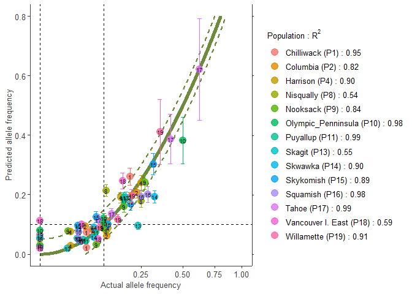<!-- -->

``` r

# Populations with low R2
manual.colour.values1 <- ggsci::pal_npg()(5)

plotB1 <- freq.ggplot(Poptri.freq.baseline, 
            plot.best=FALSE, 
            manual.colour.values=manual.colour.values1,
            xlim=c(0, 0.5),
            ylim=c(0, 0.25))
#>                   Pop Pop.label   N GAM.rsq
#> 11           Puyallup        11 186    0.99
#> 17              Tahoe        17  12    0.99
#> 10 Olympic_Penninsula        10   5    0.98
#> 16           Squamish        16  14    0.98
#> 1          Chilliwack         1  38    0.95
#> 19         Willamette        19  17    0.91
#> 4            Harrison         4  22    0.90
#> 14            Skwawka        14  14    0.90
#> 15          Skykomish        15 156    0.89
#> 9            Nooksack         9  26    0.84
#> 2            Columbia         2 180    0.82
#> 18  Vancouver I. East        18  12    0.59
#> 13             Skagit        13 163    0.55
#> 8           Nisqually         8  14    0.54
#> 7          Klinaklini         7   8    0.42
#> 6             Kitimat         6   8    0.41
#> 12             Salmon        12  11    0.34
#> 5            Homathko         5   9    0.17
#> 3                Dean         3   7    0.15
#> [1] "Dean"       "Homathko"   "Kitimat"    "Klinaklini" "Salmon"
plotB1
```

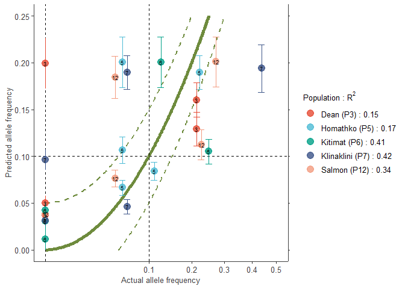<!-- -->

``` r

# Colouring by alleles

plotA2 <- freq.ggplot(Poptri.freq.baseline, 
            colour.Pop=FALSE,
            plot.best=TRUE,
            ylim=c(0.0, 0.8),
            manual.colour.values=manual.colour.values1)
#>                   Pop Pop.label   N GAM.rsq
#> 11           Puyallup        11 186    0.99
#> 17              Tahoe        17  12    0.99
#> 10 Olympic_Penninsula        10   5    0.98
#> 16           Squamish        16  14    0.98
#> 1          Chilliwack         1  38    0.95
#> 19         Willamette        19  17    0.91
#> 4            Harrison         4  22    0.90
#> 14            Skwawka        14  14    0.90
#> 15          Skykomish        15 156    0.89
#> 9            Nooksack         9  26    0.84
#> 2            Columbia         2 180    0.82
#> 18  Vancouver I. East        18  12    0.59
#> 13             Skagit        13 163    0.55
#> 8           Nisqually         8  14    0.54
#> 7          Klinaklini         7   8    0.42
#> 6             Kitimat         6   8    0.41
#> 12             Salmon        12  11    0.34
#> 5            Homathko         5   9    0.17
#> 3                Dean         3   7    0.15
#>  [1] "Chilliwack"         "Columbia"           "Harrison"          
#>  [4] "Nisqually"          "Nooksack"           "Olympic_Penninsula"
#>  [7] "Puyallup"           "Skagit"             "Skwawka"           
#> [10] "Skykomish"          "Squamish"           "Tahoe"             
#> [13] "Vancouver I. East"  "Willamette"

plotA2
```

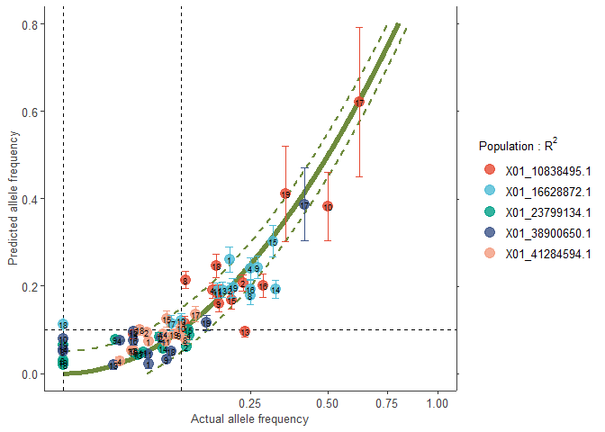<!-- -->

``` r

plotB2 <- freq.ggplot(Poptri.freq.baseline, 
            colour.Pop=FALSE,
            plot.best=FALSE, 
            manual.colour.values=manual.colour.values1,
            xlim=c(0, 0.5),
            ylim=c(0, 0.25))
#>                   Pop Pop.label   N GAM.rsq
#> 11           Puyallup        11 186    0.99
#> 17              Tahoe        17  12    0.99
#> 10 Olympic_Penninsula        10   5    0.98
#> 16           Squamish        16  14    0.98
#> 1          Chilliwack         1  38    0.95
#> 19         Willamette        19  17    0.91
#> 4            Harrison         4  22    0.90
#> 14            Skwawka        14  14    0.90
#> 15          Skykomish        15 156    0.89
#> 9            Nooksack         9  26    0.84
#> 2            Columbia         2 180    0.82
#> 18  Vancouver I. East        18  12    0.59
#> 13             Skagit        13 163    0.55
#> 8           Nisqually         8  14    0.54
#> 7          Klinaklini         7   8    0.42
#> 6             Kitimat         6   8    0.41
#> 12             Salmon        12  11    0.34
#> 5            Homathko         5   9    0.17
#> 3                Dean         3   7    0.15
#> [1] "Dean"       "Homathko"   "Kitimat"    "Klinaklini" "Salmon"

plotB2
```

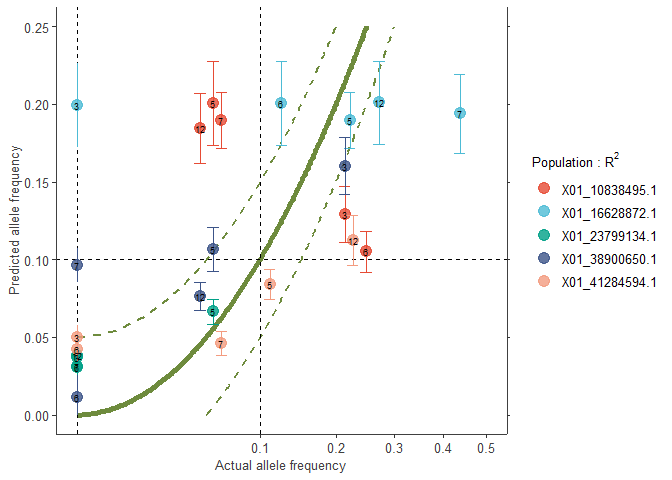<!-- -->

``` r


# Note that you can also compare data with:
poppr::poppr(Poptri.genind)
#>                   Pop   N MLG eMLG    SE     H    G lambda   E.5  Hexp       Ia
#> 1          Chilliwack  38  14 5.67 1.244 1.972 3.97  0.748 0.480 0.168  0.29948
#> 2            Columbia 180  31 6.69 1.276 2.634 8.17  0.878 0.555 0.219  0.03214
#> 3                Dean   7   4 4.00 0.000 1.352 3.77  0.735 0.967 0.145 -0.16667
#> 4            Harrison  22  10 5.87 1.093 1.855 4.10  0.756 0.575 0.191  0.06387
#> 5            Homathko   9   7 7.00 0.000 1.831 5.40  0.815 0.840 0.182 -0.17703
#> 6             Kitimat   8   4 4.00 0.000 1.321 3.56  0.719 0.930 0.127 -0.13245
#> 7          Klinaklini   8   5 5.00 0.000 1.494 4.00  0.750 0.868 0.155 -0.41248
#> 8           Nisqually  14   7 5.51 0.830 1.567 3.38  0.704 0.627 0.157  0.00845
#> 9            Nooksack  26  11 6.44 1.072 2.124 6.76  0.852 0.782 0.211  0.05709
#> 10 Olympic_Penninsula   5   3 3.00 0.000 0.950 2.27  0.560 0.802 0.191 -0.25000
#> 11           Puyallup 186  29 6.03 1.303 2.396 5.81  0.828 0.482 0.178 -0.02222
#> 12             Salmon  11   7 6.64 0.481 1.846 5.76  0.826 0.892 0.193 -0.19978
#> 13             Skagit 163  20 5.41 1.268 2.102 4.72  0.788 0.518 0.168 -0.01194
#> 14            Skwawka  14   6 5.29 0.656 1.631 4.45  0.776 0.841 0.160 -0.04804
#> 15          Skykomish 156  31 6.97 1.249 2.730 9.26  0.892 0.576 0.233  0.07931
#> 16           Squamish  14  10 7.86 0.802 2.206 8.17  0.878 0.887 0.205 -0.28884
#> 17              Tahoe  12   9 7.82 0.649 2.095 7.20  0.861 0.870 0.293 -0.11481
#> 18  Vancouver I. East  12   4 3.50 0.584 0.837 1.71  0.417 0.546 0.107  0.48361
#> 19         Willamette  17  10 6.65 1.016 2.007 5.45  0.817 0.691 0.246  0.11902
#> 20              Total 902  59 6.38 1.323 2.663 6.93  0.856 0.445 0.200  0.03621
#>       rbarD          File
#> 1   0.08166 Poptri.genind
#> 2   0.00883 Poptri.genind
#> 3  -0.16667 Poptri.genind
#> 4   0.02067 Poptri.genind
#> 5  -0.04770 Poptri.genind
#> 6  -0.14222 Poptri.genind
#> 7  -0.21444 Poptri.genind
#> 8   0.00445 Poptri.genind
#> 9   0.01646 Poptri.genind
#> 10 -0.25000 Poptri.genind
#> 11 -0.00606 Poptri.genind
#> 12 -0.07663 Poptri.genind
#> 13 -0.00373 Poptri.genind
#> 14 -0.01849 Poptri.genind
#> 15  0.02249 Poptri.genind
#> 16 -0.08273 Poptri.genind
#> 17 -0.03060 Poptri.genind
#> 18  0.27081 Poptri.genind
#> 19  0.04139 Poptri.genind
#> 20  0.00998 Poptri.genind
adegenet::makefreq(Poptri.genpop)
#> 
#>  Finding allelic frequencies from a genpop object... 
#> 
#> ...done.
#>                    X01_10838495.1 X01_10838495.2 X01_16628872.1 X01_16628872.2
#> Chilliwack             0.10526316      0.8947368     0.19736842      0.8026316
#> Columbia               0.23055556      0.7694444     0.20000000      0.8000000
#> Dean                   0.21428571      0.7857143     0.00000000      1.0000000
#> Harrison               0.15909091      0.8409091     0.25000000      0.7500000
#> Homathko               0.05555556      0.9444444     0.22222222      0.7777778
#> Kitimat                0.25000000      0.7500000     0.12500000      0.8750000
#> Klinaklini             0.06250000      0.9375000     0.43750000      0.5625000
#> Nisqually              0.10714286      0.8928571     0.25000000      0.7500000
#> Nooksack               0.17307692      0.8269231     0.26923077      0.7307692
#> Olympic_Penninsula     0.50000000      0.5000000     0.10000000      0.9000000
#> Puyallup               0.17204301      0.8279570     0.16935484      0.8306452
#> Salmon                 0.04545455      0.9545455     0.27272727      0.7272727
#> Skagit                 0.23619632      0.7638037     0.18098160      0.8190184
#> Skwawka                0.03571429      0.9642857     0.32142857      0.6785714
#> Skykomish              0.20192308      0.7980769     0.31410256      0.6858974
#> Squamish               0.28571429      0.7142857     0.25000000      0.7500000
#> Tahoe                  0.62500000      0.3750000     0.08333333      0.9166667
#> Vancouver I. East      0.16666667      0.8333333     0.00000000      1.0000000
#> Willamette             0.35294118      0.6470588     0.20588235      0.7941176
#>                    X01_23799134.1 X01_23799134.2 X01_38900650.1 X01_38900650.2
#> Chilliwack             0.06578947      0.9342105     0.05263158      0.9473684
#> Columbia               0.10833333      0.8916667     0.06944444      0.9305556
#> Dean                   0.00000000      1.0000000     0.21428571      0.7857143
#> Harrison               0.11363636      0.8863636     0.02272727      0.9772727
#> Homathko               0.05555556      0.9444444     0.05555556      0.9444444
#> Kitimat                0.00000000      1.0000000     0.00000000      1.0000000
#> Klinaklini             0.00000000      1.0000000     0.00000000      1.0000000
#> Nisqually              0.00000000      1.0000000     0.00000000      1.0000000
#> Nooksack               0.01923077      0.9807692     0.07692308      0.9230769
#> Olympic_Penninsula     0.00000000      1.0000000     0.00000000      1.0000000
#> Puyallup               0.04569892      0.9543011     0.05107527      0.9489247
#> Salmon                 0.00000000      1.0000000     0.04545455      0.9545455
#> Skagit                 0.03987730      0.9601227     0.01840491      0.9815951
#> Skwawka                0.07142857      0.9285714     0.00000000      1.0000000
#> Skykomish              0.11217949      0.8878205     0.03525641      0.9647436
#> Squamish               0.03571429      0.9642857     0.03571429      0.9642857
#> Tahoe                  0.04166667      0.9583333     0.41666667      0.5833333
#> Vancouver I. East      0.00000000      1.0000000     0.08333333      0.9166667
#> Willamette             0.00000000      1.0000000     0.14705882      0.8529412
#>                    X01_41284594.1 X01_41284594.2
#> Chilliwack             0.05263158      0.9473684
#> Columbia               0.05000000      0.9500000
#> Dean                   0.00000000      1.0000000
#> Harrison               0.02272727      0.9772727
#> Homathko               0.11111111      0.8888889
#> Kitimat                0.00000000      1.0000000
#> Klinaklini             0.06250000      0.9375000
#> Nisqually              0.10714286      0.8928571
#> Nooksack               0.09615385      0.9038462
#> Olympic_Penninsula     0.10000000      0.9000000
#> Puyallup               0.07526882      0.9247312
#> Salmon                 0.22727273      0.7727273
#> Skagit                 0.03374233      0.9662577
#> Skwawka                0.07142857      0.9285714
#> Skykomish              0.07692308      0.9230769
#> Squamish               0.03571429      0.9642857
#> Tahoe                  0.12500000      0.8750000
#> Vancouver I. East      0.04166667      0.9583333
#> Willamette             0.08823529      0.9117647


# 5. Predict future allele frequencies

Poptri.pred.future <- count.pred(Poptri.count.model, env.data=future.env)
head(Poptri.pred.future)
#>           Pop Pop.label Pop.index   N         Allele Allele.freq  A   B
#> P1 Chilliwack         1         1  76 X01_10838495.1  0.10526316  8  68
#> P2   Columbia         2         2 360 X01_10838495.1  0.23055556 83 277
#> P3       Dean         3         3  14 X01_10838495.1  0.21428571  3  11
#> P4   Harrison         4         4  44 X01_10838495.1  0.15909091  7  37
#> P5   Homathko         5         5  18 X01_10838495.1  0.05555556  1  17
#> P6    Kitimat         6         6  16 X01_10838495.1  0.25000000  4  12
#>            Ap        Bp N.e1   Freq.e1
#> P1  14.795377  61.20462   76 0.1946760
#> P2 180.233278 179.76672  360 0.5006480
#> P3   2.158522  11.84148   14 0.1541801
#> P4  14.307597  29.69240   44 0.3251727
#> P5   4.778511  13.22149   18 0.2654728
#> P6   1.939753  14.06025   16 0.1212346

Poptri.freq.future <- freq.pred(Poptri.freq.model,
                                count.predicted=Poptri.pred.future)

# The key results are variables 'Allele.freq' representing the baseline allele frequencies
# and variables 'Freq.e2', the predicted frequency for the future/ past climate.
# Variable 'Freq.e1' is the predicted allele frequency in step 1

head(Poptri.freq.future)
#>           Pop Pop.label Pop.index   N         Allele Allele.freq  A   B
#> P1 Chilliwack         1         1  76 X01_10838495.1  0.10526316  8  68
#> P2   Columbia         2         2 360 X01_10838495.1  0.23055556 83 277
#> P3       Dean         3         3  14 X01_10838495.1  0.21428571  3  11
#> P4   Harrison         4         4  44 X01_10838495.1  0.15909091  7  37
#> P5   Homathko         5         5  18 X01_10838495.1  0.05555556  1  17
#> P6    Kitimat         6         6  16 X01_10838495.1  0.25000000  4  12
#>            Ap        Bp N.e1   Freq.e1   Freq.e2       LCL       UCL increasing
#> P1  14.795377  61.20462   76 0.1946760 0.1991648 0.1744943 0.2238354       TRUE
#> P2 180.233278 179.76672  360 0.5006480 0.5742628 0.4337850 0.7147405       TRUE
#> P3   2.158522  11.84148   14 0.1541801 0.1706418 0.1510378 0.1902458      FALSE
#> P4  14.307597  29.69240   44 0.3251727 0.3542175 0.3008643 0.4075707       TRUE
#> P5   4.778511  13.22149   18 0.2654728 0.2399923 0.2146111 0.2653735       TRUE
#> P6   1.939753  14.06025   16 0.1212346 0.1181220 0.1010202 0.1352239      FALSE
```

# Visualizations

## AlleleShift::population.shift

``` r
data(Poptri.baseline.env)
data(Poptri.future.env)

VIF.select <- VIF.subset(Poptri.baseline.env, 
                         keep=c("MAT", "CMI"), 
                         cor.plot=FALSE)  
#> Step 1: Keeping these vars: 
#>  [1] "MAT"    "CMI"    "TD"     "MSP"    "AHM"    "SHM"    "DD.0"   "bFFP"  
#>  [9] "PAS"    "Eref"   "CMD"    "cmiJJA" "PPT_sm" "Tmax07"
#> 
#> Variance inflation (package: car)
#>        MAT         TD        MSP        AHM        SHM       DD.0       bFFP 
#> 1956.71402   55.35151  325.04715  258.27807  199.03579  383.71475  208.48116 
#>        PAS       Eref        CMD        CMI     cmiJJA     PPT_sm     Tmax07 
#>  418.39278  509.80399  702.97284  729.58048 2108.47844 1221.60927  404.91923 
#> 
#> VIF directly calculated from linear model with focal numeric variable as response
#>     cmiJJA        MAT     PPT_sm        CMI        CMD       Eref        PAS 
#> 2108.47844 1956.71402 1221.60927  729.58048  702.97284  509.80399  418.39278 
#>     Tmax07       DD.0        MSP        AHM       bFFP        SHM         TD 
#>  404.91923  383.71475  325.04715  258.27807  208.48116  199.03579   55.35151 
#> 
#> Variance inflation (package: car)
#>        MAT         TD        MSP        AHM        SHM       DD.0       bFFP 
#> 1152.51188   51.00442  280.39905  196.06676  189.87780  289.82940  177.01912 
#>        PAS       Eref        CMD        CMI     PPT_sm     Tmax07 
#>  373.46930  302.59709  652.89020  548.59673  527.99218  186.61090 
#> 
#> VIF directly calculated from linear model with focal numeric variable as response
#>        MAT        CMD        CMI     PPT_sm        PAS       Eref       DD.0 
#> 1152.51188  652.89020  548.59673  527.99218  373.46930  302.59709  289.82940 
#>        MSP        AHM        SHM     Tmax07       bFFP         TD 
#>  280.39905  196.06676  189.87780  186.61090  177.01912   51.00442 
#> 
#> Variance inflation (package: car)
#>       MAT        TD       MSP       AHM       SHM      DD.0      bFFP       PAS 
#> 775.21530  48.40917 275.40371 179.50626  90.11375 260.05137 146.29625 368.40367 
#>      Eref       CMI    PPT_sm    Tmax07 
#> 102.83305 545.11114 394.89879 180.19703 
#> 
#> VIF directly calculated from linear model with focal numeric variable as response
#>       MAT       CMI    PPT_sm       PAS       MSP      DD.0    Tmax07       AHM 
#> 775.21530 545.11114 394.89879 368.40367 275.40371 260.05137 180.19703 179.50626 
#>      bFFP      Eref       SHM        TD 
#> 146.29625 102.83305  90.11375  48.40917 
#> 
#> Variance inflation (package: car)
#>       MAT        TD       MSP       AHM       SHM      DD.0      bFFP       PAS 
#> 528.61146  32.01349 145.93063  78.09567  53.38943 222.17330 145.00874 188.09374 
#>      Eref       CMI    Tmax07 
#> 102.40225 306.50400 111.10074 
#> 
#> VIF directly calculated from linear model with focal numeric variable as response
#>       MAT       CMI      DD.0       PAS       MSP      bFFP    Tmax07      Eref 
#> 528.61146 306.50400 222.17330 188.09374 145.93063 145.00874 111.10074 102.40225 
#>       AHM       SHM        TD 
#>  78.09567  53.38943  32.01349 
#> 
#> Variance inflation (package: car)
#>       MAT        TD       MSP       AHM       SHM      bFFP       PAS      Eref 
#> 291.46937  30.38197  64.59840  46.78232  37.94467  45.37584  45.57930  99.66232 
#>       CMI    Tmax07 
#>  93.58775 109.62229 
#> 
#> VIF directly calculated from linear model with focal numeric variable as response
#>       MAT    Tmax07      Eref       CMI       MSP       AHM       PAS      bFFP 
#> 291.46937 109.62229  99.66232  93.58775  64.59840  46.78232  45.57930  45.37584 
#>       SHM        TD 
#>  37.94467  30.38197 
#> 
#> Variance inflation (package: car)
#>        MAT         TD        MSP        AHM        SHM       bFFP        PAS 
#> 237.300281   4.513064  62.232526  46.486704  37.871152  44.616210  44.930713 
#>       Eref        CMI 
#>  33.411744  85.667431 
#> 
#> VIF directly calculated from linear model with focal numeric variable as response
#>        MAT        CMI        MSP        AHM        PAS       bFFP        SHM 
#> 237.300281  85.667431  62.232526  46.486704  44.930713  44.616210  37.871152 
#>       Eref         TD 
#>  33.411744   4.513064 
#> 
#> Variance inflation (package: car)
#>        MAT         TD        AHM        SHM       bFFP        PAS       Eref 
#> 218.240423   4.170754  25.872364   5.680412  43.733182  39.989330  32.625175 
#>        CMI 
#>  27.162467 
#> 
#> VIF directly calculated from linear model with focal numeric variable as response
#>        MAT       bFFP        PAS       Eref        CMI        AHM        SHM 
#> 218.240423  43.733182  39.989330  32.625175  27.162467  25.872364   5.680412 
#>         TD 
#>   4.170754 
#> 
#> Variance inflation (package: car)
#>       MAT        TD       AHM       SHM       PAS      Eref       CMI 
#> 56.168045  4.154401 24.524555  5.474406 31.877700 13.105090 22.368212 
#> 
#> VIF directly calculated from linear model with focal numeric variable as response
#>       MAT       PAS       AHM       CMI      Eref       SHM        TD 
#> 56.168045 31.877700 24.524555 22.368212 13.105090  5.474406  4.154401 
#> 
#> Variance inflation (package: car)
#>       MAT        TD       AHM       SHM      Eref       CMI 
#>  8.713339  4.003336 19.299959  5.465614  9.025702 14.431931 
#> 
#> VIF directly calculated from linear model with focal numeric variable as response
#>       AHM       CMI      Eref       MAT       SHM        TD 
#> 19.299959 14.431931  9.025702  8.713339  5.465614  4.003336 
#> 
#> Summary of VIF selection process:
#>                MAT        TD       MSP       AHM        SHM     DD.0      bFFP
#> step_1 1956.714025 55.351511 325.04715 258.27807 199.035789 383.7148 208.48116
#> step_2 1152.511883 51.004421 280.39905 196.06676 189.877801 289.8294 177.01912
#> step_3  775.215296 48.409171 275.40371 179.50626  90.113750 260.0514 146.29625
#> step_4  528.611459 32.013493 145.93063  78.09567  53.389431 222.1733 145.00874
#> step_5  291.469373 30.381965  64.59840  46.78232  37.944668       NA  45.37584
#> step_6  237.300281  4.513064  62.23253  46.48670  37.871152       NA  44.61621
#> step_7  218.240423  4.170754        NA  25.87236   5.680412       NA  43.73318
#> step_8   56.168045  4.154401        NA  24.52456   5.474406       NA        NA
#> step_9    8.713339  4.003336        NA  19.29996   5.465614       NA        NA
#>              PAS       Eref      CMD       CMI   cmiJJA    PPT_sm   Tmax07
#> step_1 418.39278 509.803994 702.9728 729.58048 2108.478 1221.6093 404.9192
#> step_2 373.46930 302.597094 652.8902 548.59673       NA  527.9922 186.6109
#> step_3 368.40367 102.833047       NA 545.11114       NA  394.8988 180.1970
#> step_4 188.09374 102.402249       NA 306.50400       NA        NA 111.1007
#> step_5  45.57930  99.662321       NA  93.58775       NA        NA 109.6223
#> step_6  44.93071  33.411744       NA  85.66743       NA        NA       NA
#> step_7  39.98933  32.625175       NA  27.16247       NA        NA       NA
#> step_8  31.87770  13.105090       NA  22.36821       NA        NA       NA
#> step_9        NA   9.025702       NA  14.43193       NA        NA       NA
#> 
#> Final selection of variables:
#> [1] "AHM"  "CMI"  "Eref" "MAT"  "SHM"  "TD"

VIF.select$vars.included
#> [1] "AHM"  "CMI"  "Eref" "MAT"  "SHM"  "TD"

baseline.env <- Poptri.baseline.env[, VIF.select$vars.included] 
future.env <- Poptri.future.env[, VIF.select$vars.included] 

plotA <- population.shift(baseline.env, 
                 future.env,
                 option="PCA")
#> OK
```

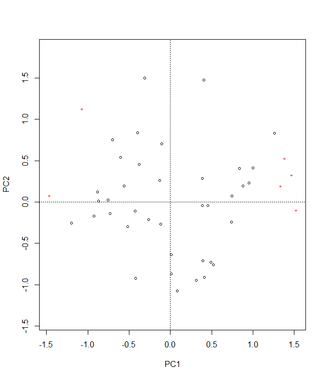<!-- -->

``` r
plotA
```

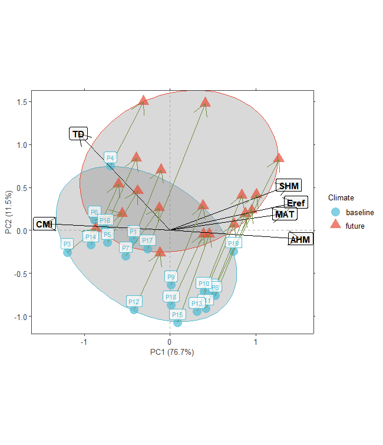<!-- -->

``` r

plotB <- population.shift(baseline.env, 
                 future.env,
                 option="RDA")
#> OK
```

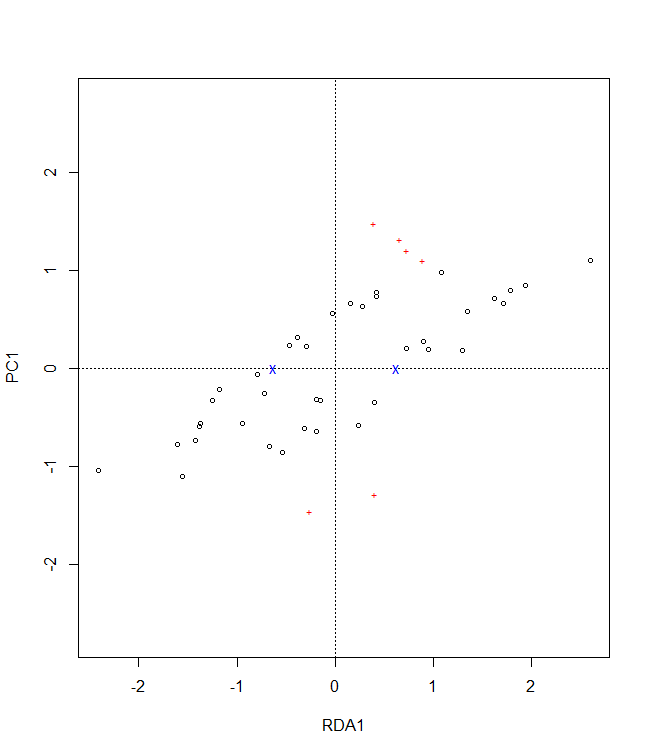<!-- -->

``` r
plotB
```

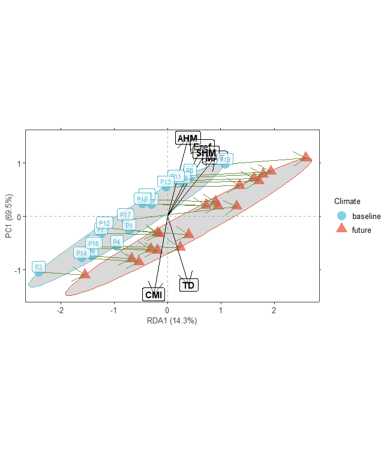<!-- -->

## AlleleShift::shift.dot.ggplot

``` r
# The data can be obtained via the count.model and freq.model calibrations.
# These procedures are not repeated here.
data(Poptri.freq.future)

ggdot1 <- shift.dot.ggplot(Poptri.freq.future)
ggdot1
```

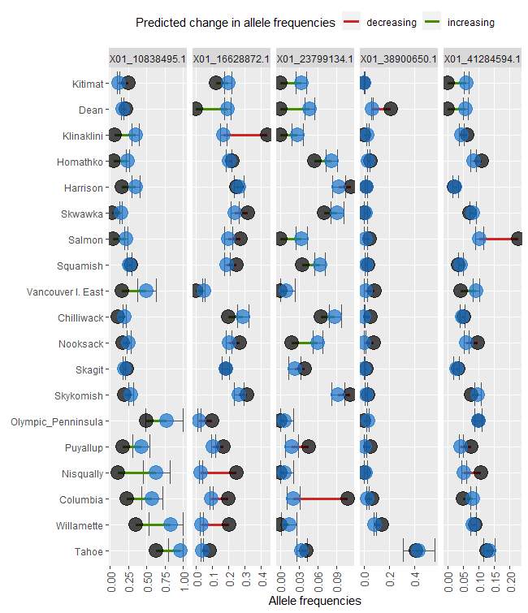<!-- -->

## AlleleShift::shift.pie.ggplot

``` r
# The data can be obtained via the count.model and freq.model calibrations.
# These procedures are not repeated here.
data(Poptri.freq.baseline)
data(Poptri.freq.future)

Poptri.baseline.pie <- pie.baker(Poptri.freq.baseline, r0=0.1,
                                 sort.index="Latitude.index")

Poptri.future.pie <- pie.baker(Poptri.freq.future, r0=0.1, 
                        freq.focus="Freq.e2",
                        sort.index="Latitude.index",
                        ypos=1)

ggpie1 <- shift.pie.ggplot(Poptri.baseline.pie, 
                           Poptri.future.pie)
ggpie1
```

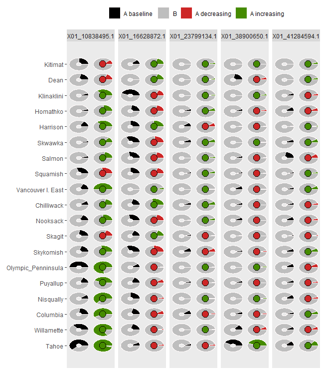<!-- -->

## AlleleShift::shift.moon.ggplot

``` r
# The data can be obtained via the count.model and freq.model calibrations.
# These procedures are not repeated here.
data(Poptri.freq.baseline)
data(Poptri.freq.future)

Poptri.baseline.moon <- moon.waxer(Poptri.freq.baseline,
                                   sort.index="Latitude.index")

Poptri.future.moon <- moon.waxer(Poptri.freq.future, 
                                 sort.index="Latitude.index",
                                 freq.focus="Freq.e2",
                                ypos=1)

ggmoon1 <- shift.moon.ggplot(Poptri.baseline.moon, 
                             Poptri.future.moon)
ggmoon1
```

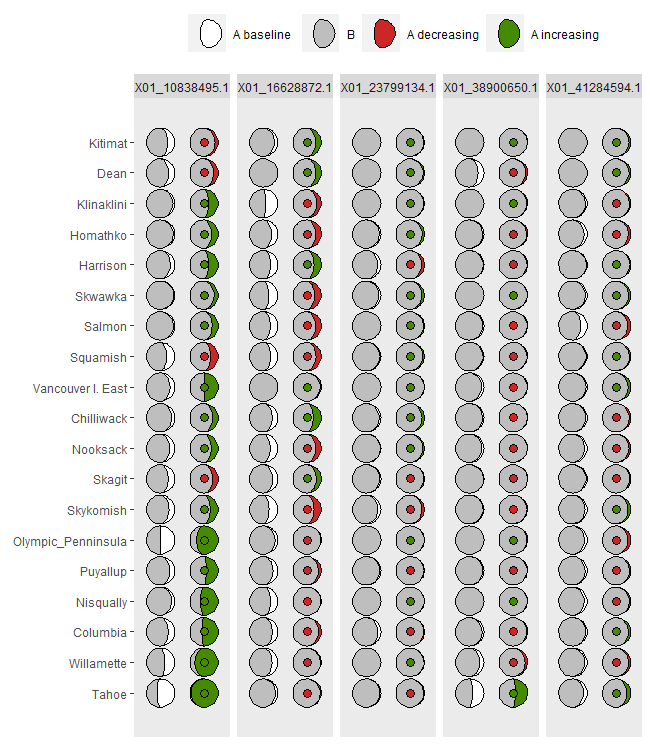<!-- -->

## AlleleShift::shift.waffle.ggplot

``` r
# The data can be obtained via the count.model and freq.model calibrations.
# These procedures are not repeated here.
data(Poptri.freq.baseline)
data(Poptri.freq.future)

Poptri.future.waffle <- waffle.baker(Poptri.freq.future,
                           sort.index="Latitude.index")

ggwaffle1 <- shift.waffle.ggplot(Poptri.future.waffle)
ggwaffle1
```

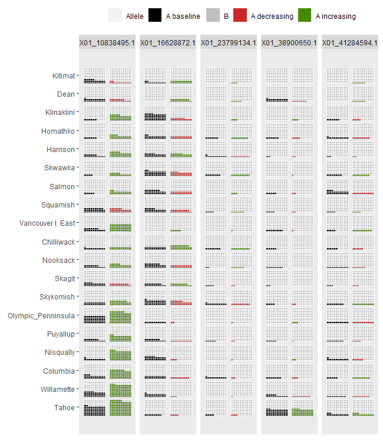<!-- -->

## AlleleShift::shift.surf.ggplot

``` r
# The data can be obtained via the count.model and freq.model calibrations.
# These procedures are not repeated here.
data(Poptri.freq.baseline)
data(Poptri.freq.future)

# Plots for the first allele
# Symbols and colours indicate future change (green, ^ = future increase)
# Symbol size reflects the frequency in the climate shown

# Baseline climate
plotA <- shift.surf.ggplot(Poptri.freq.future,
                  xcoord="Long", ycoord="Lat",
                  Allele.focus=unique(Poptri.freq.future$Allele)[1], 
                  freq.focus="Allele.freq")
```

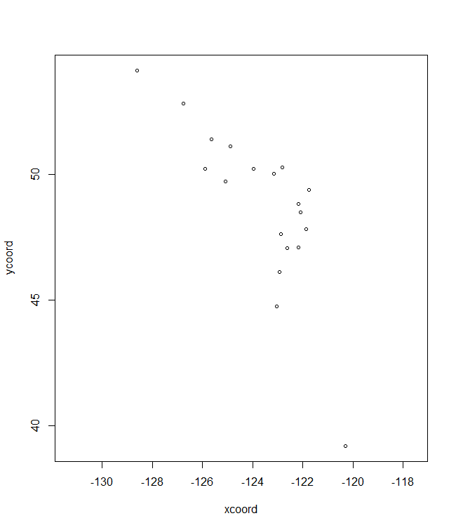<!-- -->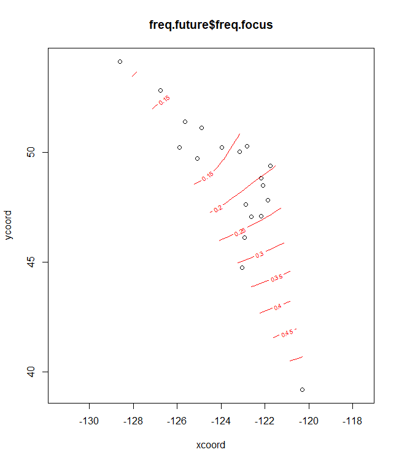<!-- -->

``` r
plotA
```

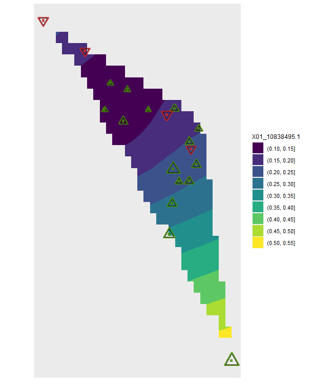<!-- -->

``` r

# Future/past climate
plotB <- shift.surf.ggplot(Poptri.freq.future,
                  xcoord="Long", ycoord="Lat",
                  Allele.focus=unique(Poptri.freq.future$Allele)[1], 
                  freq.focus="Freq.e2")
```

<!-- -->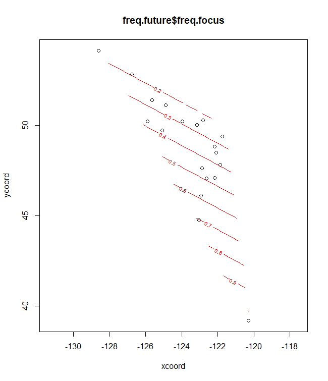<!-- -->

``` r
plotB
```

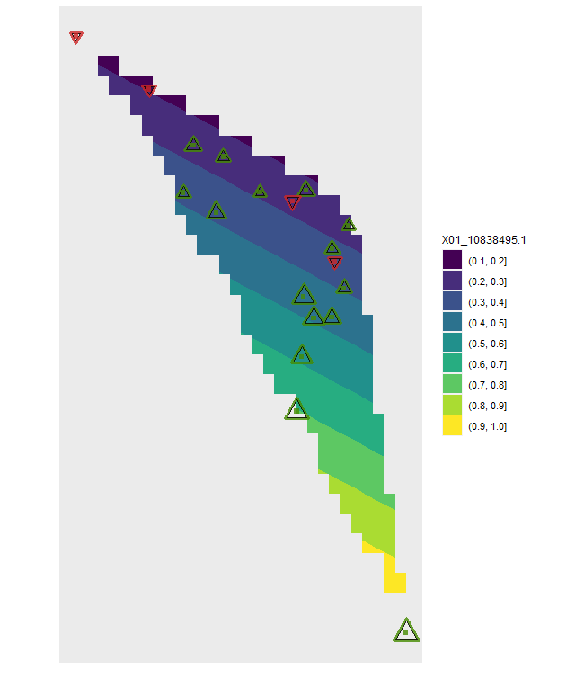<!-- -->

``` r

# Plots for the fifth allele

# Baseline climate
plotC <- shift.surf.ggplot(Poptri.freq.future,
                  xcoord="Long", ycoord="Lat",
                  Allele.focus=unique(Poptri.freq.future$Allele)[5], 
                  freq.focus="Allele.freq")
```

<!-- -->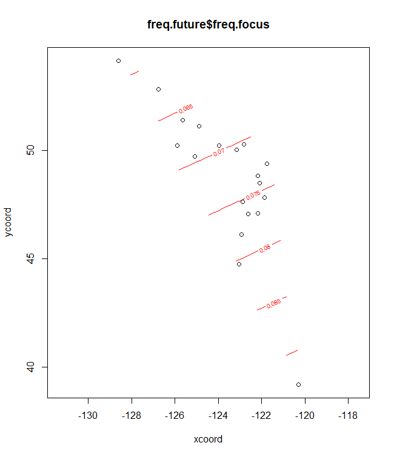<!-- -->

``` r
plotC
```

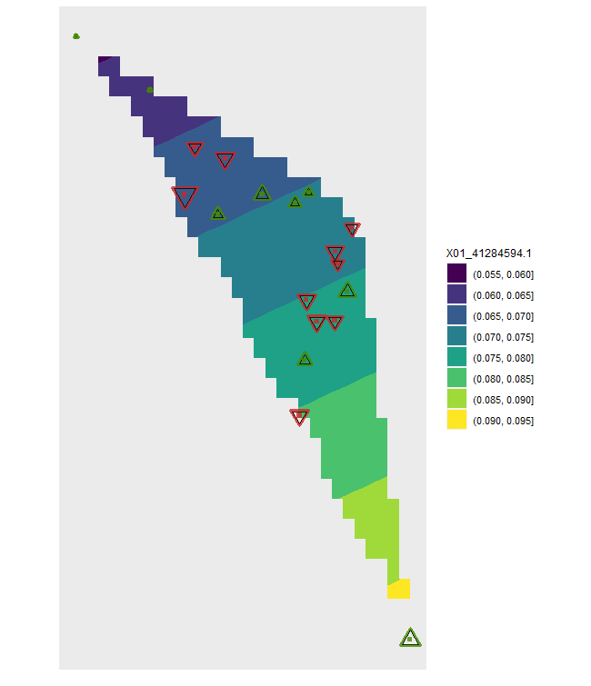<!-- -->

``` r


plotD <- shift.surf.ggplot(Poptri.freq.future,
                  xcoord="Long", ycoord="Lat",
                  Allele.focus=unique(Poptri.freq.future$Allele)[5], 
                  freq.focus="Freq.e2")
```

<!-- --><!-- -->

``` r
plotD
```

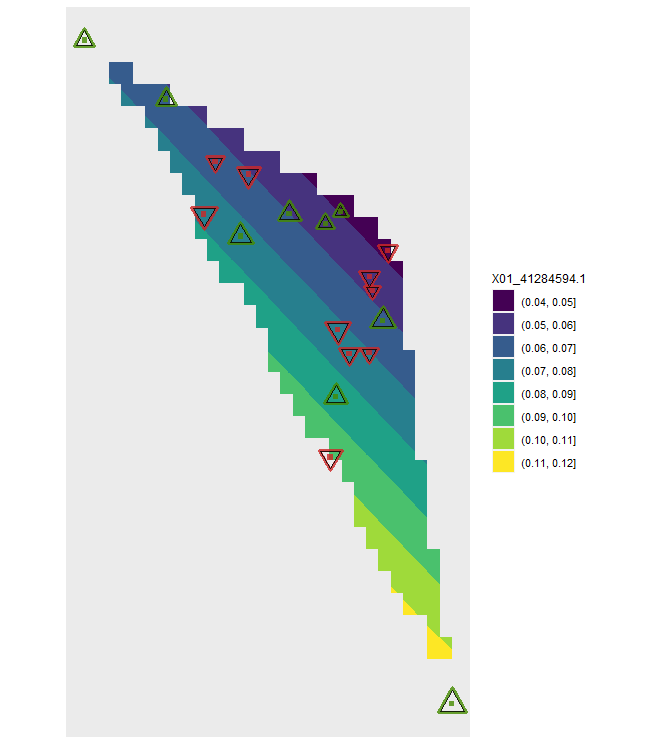<!-- -->

## Animations

With graphs that are generated via **ggplot2**, it is straightforward to
create animations. The following example is also avaiable from the
documentation of ‘AlleleShift::shift.dot.ggplot’

``` r
# create an animation

library(ggplot2)
library(gganimate)
library(gifski)
#> Warning: package 'gifski' was built under R version 4.0.3

# The data is an interpolation and extrapolation between the baseline and future climate.
# For actual application, interpolate between climate data from available sources

data(Poptri.1985to2085)

ggdot.all <- ggplot(data=Poptri.1985to2085, group=Decade) +
  scale_y_continuous(limits=c(-0.1, 1.1),
                     breaks=c(0.0, 0.25, 0.5, 0.75, 1.0)) +
  geom_errorbar(aes(x=Pop, ymin=LCL, ymax=UCL),
                colour="grey30", width=0.8, show.legend=FALSE) +
  geom_segment(aes(x=Pop, y=Allele.freq, xend=Pop, yend=Freq.e2, colour=increasing),
               size=1.2) +  
  geom_point(aes(x=Pop, y=Allele.freq),
             colour="black", size=10, alpha=0.7) +                    
  geom_point(aes(x=Pop, y=Freq.e2),
             colour="dodgerblue3", size=10, alpha=0.7) +  
  coord_flip() +
  xlab(element_blank()) +
  ylab("Allele frequencies") +
  theme(panel.grid.minor = element_blank()) +
  labs(colour="Future change in allele frequencies") +
  scale_colour_manual(values=c("firebrick3", "chartreuse4"), 
                      labels=c("decreasing", "increasing")) +
  theme(axis.text.x=element_text(angle=90, vjust=0.5, size=10)) +
  theme(legend.position="top") +
  facet_grid( ~ Allele, scales="free")

ggdot.all
```

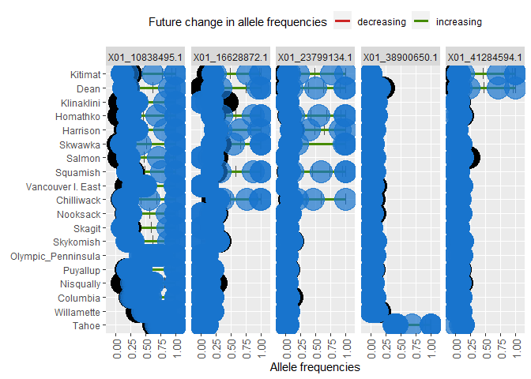<!-- -->

``` r

ggdot.anim <- ggdot.all + 
  transition_states(as.factor(Decade), transition_length = 10, state_length = 100) +
  labs(title = "Decade: {closest_state}s")
```

Show the animation

``` r
animate(ggdot.anim, fps=5, width=1280, height=720)
```

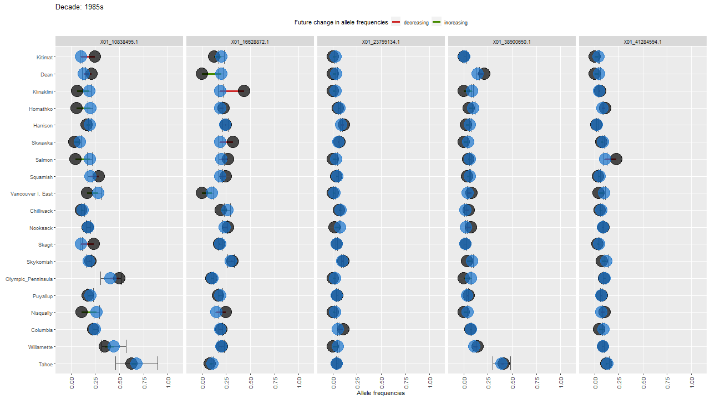<!-- -->

``` r
sessionInfo()
#> R version 4.0.2 (2020-06-22)
#> Platform: x86_64-w64-mingw32/x64 (64-bit)
#> Running under: Windows 10 x64 (build 18363)
#> 
#> Matrix products: default
#> 
#> locale:
#> [1] LC_COLLATE=English_United Kingdom.1252 
#> [2] LC_CTYPE=English_United Kingdom.1252   
#> [3] LC_MONETARY=English_United Kingdom.1252
#> [4] LC_NUMERIC=C                           
#> [5] LC_TIME=English_United Kingdom.1252    
#> 
#> attached base packages:
#> [1] tcltk     stats     graphics  grDevices utils     datasets  methods  
#> [8] base     
#> 
#> other attached packages:
#>  [1] gifski_0.8.6         AlleleShift_0.9      gganimate_1.0.7     
#>  [4] gggibbous_0.1.0      ggmap_3.0.0          mgcv_1.8-31         
#>  [7] nlme_3.1-148         GGally_2.0.0         patchwork_1.1.1     
#> [10] ggrepel_0.8.2        dplyr_1.0.2          ggforce_0.3.2       
#> [13] ggsci_2.9            ggplot2_3.3.2        poppr_2.8.6         
#> [16] adegenet_2.1.3       ade4_1.7-16          BiodiversityR_2.12-3
#> [19] vegan_2.5-6          lattice_0.20-41      permute_0.9-5       
#> 
#> loaded via a namespace (and not attached):
#>   [1] readxl_1.3.1        backports_1.1.7     Hmisc_4.4-0        
#>   [4] fastmatch_1.1-0     plyr_1.8.6          igraph_1.2.6       
#>   [7] sp_1.4-2            splines_4.0.2       digest_0.6.25      
#>  [10] htmltools_0.5.0     gdata_2.18.0        relimp_1.0-5       
#>  [13] magrittr_1.5        checkmate_2.0.0     cluster_2.1.0      
#>  [16] openxlsx_4.1.5      tcltk2_1.2-11       gmodels_2.18.1     
#>  [19] sandwich_2.5-1      prettyunits_1.1.1   jpeg_0.1-8.1       
#>  [22] colorspace_1.4-1    mitools_2.4         haven_2.3.1        
#>  [25] xfun_0.15           crayon_1.3.4        lme4_1.1-23        
#>  [28] survival_3.1-12     zoo_1.8-8           phangorn_2.5.5     
#>  [31] ape_5.4             glue_1.4.1          polyclip_1.10-0    
#>  [34] gtable_0.3.0        seqinr_4.2-4        polysat_1.7-4      
#>  [37] car_3.0-8           abind_1.4-5         scales_1.1.1       
#>  [40] DBI_1.1.0           Rcpp_1.0.4.6        isoband_0.2.1      
#>  [43] viridisLite_0.3.0   xtable_1.8-4        progress_1.2.2     
#>  [46] spData_0.3.8        htmlTable_2.0.0     units_0.6-7        
#>  [49] foreign_0.8-80      spdep_1.1-5         Formula_1.2-3      
#>  [52] survey_4.0          httr_1.4.2          htmlwidgets_1.5.1  
#>  [55] RColorBrewer_1.1-2  acepack_1.4.1       ellipsis_0.3.1     
#>  [58] reshape_0.8.8       pkgconfig_2.0.3     farver_2.0.3       
#>  [61] nnet_7.3-14         deldir_0.2-3        labeling_0.3       
#>  [64] tidyselect_1.1.0    rlang_0.4.8         reshape2_1.4.4     
#>  [67] later_1.1.0.1       munsell_0.5.0       cellranger_1.1.0   
#>  [70] tools_4.0.2         generics_0.1.0      evaluate_0.14      
#>  [73] stringr_1.4.0       fastmap_1.0.1       yaml_2.2.1         
#>  [76] knitr_1.28          zip_2.0.4           purrr_0.3.4        
#>  [79] RgoogleMaps_1.4.5.3 mime_0.9            compiler_4.0.2     
#>  [82] rstudioapi_0.11     curl_4.3            png_0.1-7          
#>  [85] e1071_1.7-3         tibble_3.0.1        statmod_1.4.34     
#>  [88] tweenr_1.0.1        stringi_1.4.6       forcats_0.5.0      
#>  [91] Matrix_1.2-18       classInt_0.4-3      nloptr_1.2.2.1     
#>  [94] vctrs_0.3.4         effects_4.1-4       RcmdrMisc_2.7-0    
#>  [97] pillar_1.4.4        LearnBayes_2.15.1   lifecycle_0.2.0    
#> [100] bitops_1.0-6        data.table_1.12.8   raster_3.4-5       
#> [103] httpuv_1.5.4        R6_2.4.1            latticeExtra_0.6-29
#> [106] promises_1.1.1      KernSmooth_2.23-17  gridExtra_2.3      
#> [109] rio_0.5.16          codetools_0.2-16    boot_1.3-25        
#> [112] MASS_7.3-51.6       gtools_3.8.2        rjson_0.2.20       
#> [115] withr_2.2.0         nortest_1.0-4       Rcmdr_2.6-2        
#> [118] pegas_0.14          expm_0.999-5        parallel_4.0.2     
#> [121] hms_0.5.3           quadprog_1.5-8      grid_4.0.2         
#> [124] rpart_4.1-15        tidyr_1.1.2         coda_0.19-3        
#> [127] class_7.3-17        minqa_1.2.4         rmarkdown_2.3      
#> [130] carData_3.0-4       sf_0.9-6            shiny_1.4.0.2      
#> [133] base64enc_0.1-3
```
